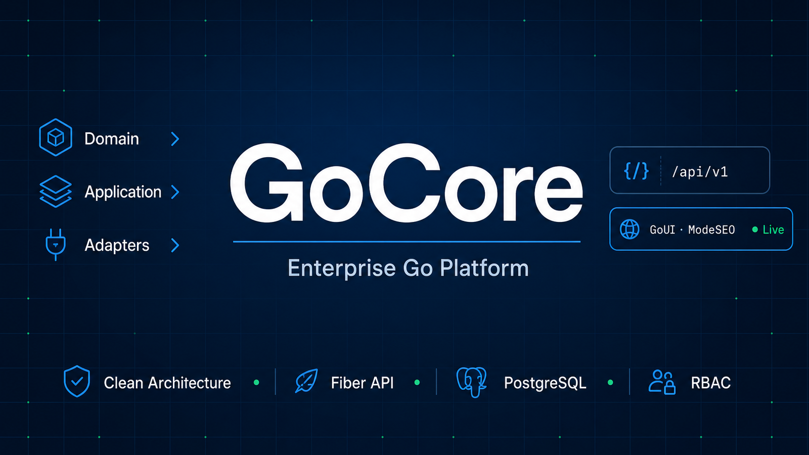

# GoCore

<p align="center">
  
</p>

Enterprise Go platform built with **Clean Architecture**, **Hexagonal design**, **DDD**, and **CQRS**.

One Fiber process serves both a versioned JSON REST API (`/api/v1`) and a **GoUI** admin panel. Domain and application layers are shared; HTTP handlers and GoUI controllers are thin transports wired in `internal/bootstrap`.

| | |
|---|---|
| Module | [`github.com/zatrano/gocore`](https://github.com/zatrano/gocore) |
| Go | 1.25.12 |
| HTTP | Fiber v3 |
| UI | [GoUI](https://github.com/zatrano/goui) v1 — server-driven + WebSocket |
| Database | PostgreSQL · pgxpool · sqlc |

Public marketing pages (`/`, `/contact`) use **ModeSEO** (SSR HTML + WS hydrate). Auth and dashboard screens use **ModeLive** (empty shell filled over `/goui/ws`).

Designed for **single-process** deploy: JWT refresh store, rate limits, and authz/settings caches live in memory — **no Redis required**.

## Features

- **Identity** — JWT access/refresh with rotation; MFA TOTP; email verification; password reset; OAuth (Google / GitHub); Cloudflare Turnstile on public forms; login lockout
- **Users** — list, create, activate, soft-delete / restore, role change, profile; admin password set from the panel
- **RBAC** — roles and permissions in PostgreSQL; `RequirePermission` on API and panel routes
- **Notifications** — in-app inbox, single + bulk send (JSON / CSV / Excel); SMS (Netgsm / İleti Merkezi) and email channels
- **Payments** — Iyzico / Moka 3DS, BIN lookup, webhooks, transaction list
- **Contact** — public form + admin inbox
- **Settings** — active SMS and payment providers from the dashboard
- **Audit** — searchable action logs
- **Uploads** — size / MIME-restricted storage
- **i18n** — `tr` / `en`
- **Realtime** — GoUI Live (`/goui/ws`) and app hub (`/api/v1/ws`, e.g. `inbox.updated`)
- **API docs** — OpenAPI 3.1 + Swagger UI

## Quick start

```bash
cp .env.example .env
# Set DB_* (and secrets as needed)

go run ./cmd/migrate up
go run ./cmd/seed
go run ./cmd/server
```

| URL | Description |
|---|---|
| http://localhost:8080/ | Web / home (ModeSEO) |
| http://localhost:8080/dashboard | Admin panel |
| http://localhost:8080/api/v1 | REST API |
| http://localhost:8080/docs | Swagger UI |
| http://localhost:8080/openapi.yaml | OpenAPI 3.1 |

Development seed admin: `zatrano@zatrano.com` / `ZATRANO`  
*(Change this password before any production use.)*

Health probes: `/livez`, `/readyz`, `/healthz`.

## Architecture

```
cmd/                  server, migrate, seed
internal/
  domain/             entities, value objects, repository ports
  application/        use-cases / CQRS + service facades
  adapters/
    http/             JSON API (Fiber)
    goui/             panel + public ModeSEO pages
    persistence/      sqlc + PostgreSQL repositories
  infrastructure/     config, security, email, SMS, payment, outbox, realtime…
  bootstrap/          composition root (Build + wire_*.go)
pkg/                  rbac, i18n, validation, pagination, recipients, tabular…
migrations/           schema + seed SQL
db/queries/           sqlc sources
api/openapi.yaml      API contract
docs/                 deep-dive guides
```

Dependency direction: **domain ← application ← adapters**. Infrastructure sits outside and is composed in `bootstrap`.

Start here: [docs/READING.md](docs/READING.md) — folder map, naming glossary, golden paths (login + user list).

## Development

```bash
go test ./...
go test -race ./...
golangci-lint run
sqlc generate
```

CI (`.github/workflows/ci.yml`): lint, race tests, `govulncheck`, `gosec`, build.

```bash
go build -o bin/server ./cmd/server
go build -o bin/migrate ./cmd/migrate
go build -o bin/seed ./cmd/seed
```

## Configuration

Copy [`.env.example`](.env.example). Main groups:

`APP_*` · `HTTP_*` · `DB_*` · `AUTH_*` · `OAUTH_*` · `SEC_*` · `I18N_*` · `SMTP_*` · `CONTACT_*` · `NOTIFY_*` · `PAYMENT_*`

The process **fail-fast validates** env on boot. Production checklist (TLS, Turnstile, encryption keys, CORS, WebSocket proxy): [docs/DEPLOY.md](docs/DEPLOY.md).

Reverse proxies must allow WebSocket upgrades for `/goui/ws` and `/api/v1/ws`.

## Documentation

| Doc | Content |
|---|---|
| [docs/READING.md](docs/READING.md) | First read — map, glossary, golden paths |
| [docs/DOMAIN.md](docs/DOMAIN.md) | Architecture and bounded contexts |
| [docs/AUTH.md](docs/AUTH.md) | Auth, sessions, MFA, OAuth, RBAC |
| [docs/PAYMENT.md](docs/PAYMENT.md) | 3DS, providers, webhooks |
| [docs/VALIDATION.md](docs/VALIDATION.md) | Input validation and i18n errors |
| [docs/DEPLOY.md](docs/DEPLOY.md) | Environment and production checklist |
| [docs/YENI_MODUL_EKLEME.md](docs/YENI_MODUL_EKLEME.md) | Adding a new bounded context |
| [docs/map/](docs/map/) | Per-context file maps |

## Module versions

```bash
go get github.com/zatrano/gocore@latest
go get github.com/zatrano/gocore@v1.1.1
```

## License

See repository license / project policy for distribution terms.
